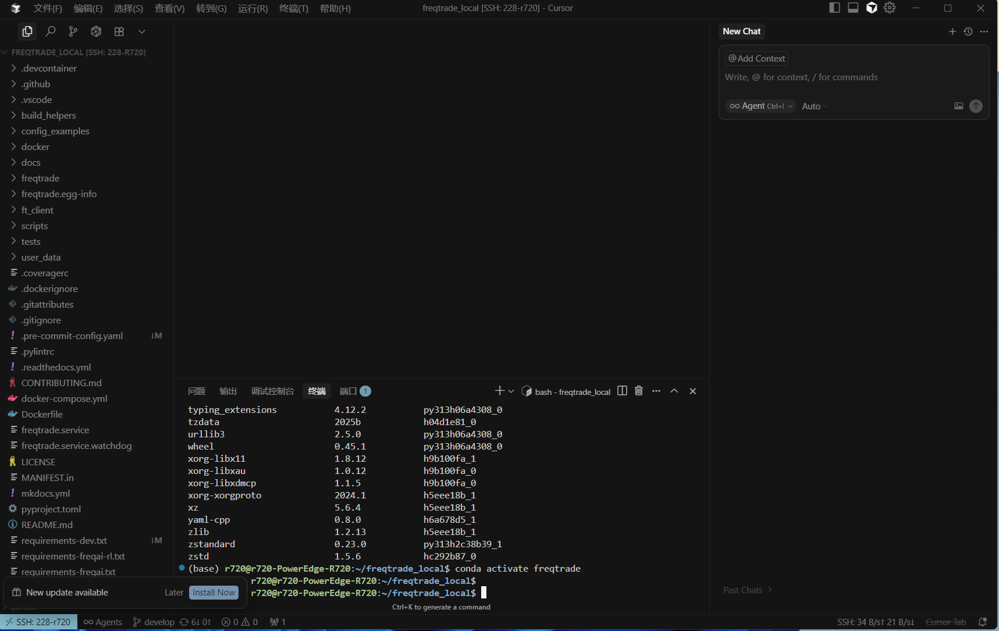
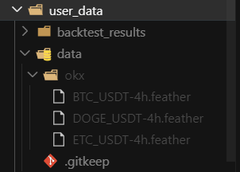

#### 打开cursor
打开终端：

进入环境：
```
conda activate freqtrade

```
下载数据(btc/etc/doge 4小时数据和1小时数据)：
```
# timeframes ='1m', '3m', '5m', '15m', '30m', '1h', '2h', '4h', '6h', '12h', '1d', '1w', '1M', '3M'
freqtrade download-data --exchange okx --pairs BTC/USDT ETC/USDT DOGE/USDT --timeframes 4h --timerange 20230101-20250920
freqtrade download-data --exchange okx --pairs BTC/USDT ETC/USDT DOGE/USDT --timeframes 1h --timerange 20230101-20250920
```


#### 日常建议重点掌握的命令
```
  freqtrade download-data
  freqtrade backtesting
  freqtrade hyperopt
  freqtrade trade
  freqtrade show-trades
```
|分类| 命令示例| 用途概览|
| :-------------| :-------------------------| :---------------------|
| 数据处理| ```download-data```, ```convert-data```| 下载 / 处理历史市场数据|
| 策略开发与测试| ```new-strategy```, ```backtesting```, ```hyperopt``` |创建和测试交易策略|
| 实盘交易|```trade```, ```webserver```|启动机器人，执行交易或 Dry-run|
| 系统配置|```new-config```, ```create-userdir```|初始化配置和项目结构|
| 查询与诊断|```show-trades```, ```list-data```, ```list-pairs```|查询策略、数据、交易记录|
| 可视化分析|```plot-dataframe```| 图表可视化策略行为|

### 启动实盘或模拟交易机器人的核心命令:
> freqtrade trade +参数

|参数                       |      含义      |
| :-------------------------| :-------------|
|--config        |指定配置文件路径|
|--strategy      |启动使用的策略类名|
|--dry-run       |开启干跑（模拟交易）模式，推荐默认启用 不实际下单，只模拟下单并记录日志|
|--logfile       |指定日志输出位置|
|--db-url        |指定数据库文件或连接（记录交易历史）|
|--userdir       |设置用户目录路径（默认 user_data/）|

### 实盘启动前应做的检查：

|检查项|建议 |
| :-------------------------| :-----------------------|
|策略是否通过回测            |✅ 至少覆盖 6 个月以上历史|
|是否在 Dry-run 模式下运行过 | ✅ 模拟运行 7 天以上|
|config.json 配置是否完整   |✅ 包含风控、币种、杠杆等|
|是否设置了 API Key         |✅ 且建议设置 IP 白名单|
|是否观察日志和错误输出      |✅ 使用 --logfile 保存记录|

### 回测推荐流程：
1.回测策略：
```
   freqtrade backtesting \
   --config user_data/config.json \
   --strategy MyStrategy \
   --timeframe 15m \
   --timerange 20220101-20230101
```
2.绘制图表：
```
   freqtrade plot-dataframe \
   --config user_data/config.json \
   --strategy MyStrategy \
   --timerange 20250601-20250626
```
3.分析图表：
- 1.判断策略买入是否太早/太晚？
- 2.是否频繁误报信号？
- 3.各种指标是否有效？ 掌握 plot-dataframe，从此策略优化有据可依、调优更高效！

### 实盘使用建议
|用途     |方法     |
| :-------------------------| :-----------------------|
|检查策略逻辑是否合理        |查看买卖点是否在合适位置|
|辅助调试                   |比对指标与信号关系|
|策略分享                   |生成图表后输出为 HTML，方便演示|
|评估指标表现               |同时绘制多个指标看是否冗余|

### 使用流程：
1.回测策略：
```
    freqtrade backtesting \
    --config user_data/config.json \
    --strategy MyStrategy \
    --timeframe 15m \
    --timerange 20220101-20230101
```
2.绘制图表：
```
    freqtrade plot-dataframe \
    --config user_data/config.json \
    --strategy MyStrategy \
    --timerange 20250601-20250626
```
3.分析图表：
- 1.判断策略买入是否太早/太晚？
- 2.是否频繁误报信号？
- 3.各种指标是否有效？ 掌握 plot-dataframe，从此策略优化有据可依、调优更高效！

### 基础用法：绘制图表
    freqtrade plot-dataframe \
    --config user_data/config.json \
    --strategy MyStrategy \
    --timerange 20230101-20230201

#### 执行后会在 user_data/plot/ 下生成一个 .html 文件，可直接双击浏览器查看，包含以下内容：
- K线价格走势
- 买卖点（Buy/Sell 箭头）
- 技术指标（如 EMA、MACD 等）

### 参数详解
|参数                 |含义|
| :-------------------| :---------------------------|
| --config            | 配置文件路径，需包含交易对、时间周期等|
| --strategy          | 策略类名（如 MyStrategy）|
| --timerange         | 指定绘图时间段，格式如 20230101-20230201|
| --indicators1       | 绘制在主图上的指标（如 EMA、close）|
| --indicators2       | 副图指标（如 RSI、MACD）|
| --exportfilename    | 导出文件路径（支持 .html 或 .png）|
| --userdir           | 自定义 user_data 路径（默认即可）|

### 添加自定义指标:
> 你可以在图表中加入额外的指标，以验证信号逻辑：

```
    def populate_indicators(self, dataframe: DataFrame, metadata: dict) -> DataFrame:
        dataframe['ema'] = ta.EMA(dataframe['close'], timeperiod=20)
        dataframe['fast_ema'] = ta.EMA(dataframe['close'], timeperiod=10)
        dataframe['slow_ema'] = ta.EMA(dataframe['close'], timeperiod=50)
        dataframe['rsi'] = ta.RSI(dataframe['close'], timeperiod=14)
        macd, macdsignal, macdhist = ta.MACD(dataframe['close'])
        dataframe['macd'] = macd
        return dataframe
```
- --indicators1 会绘制在主图（价格图）上，比如 EMA 线。

- --indicators2 会绘制在副图中，比如 RSI、MACD。

#### 完整示例：
```
    freqtrade plot-dataframe \
    --config user_data/config.json \
    --strategy MyStrategy \
    --timerange 20230101-20230201 \
    --indicators1 close ema fast_ema slow_ema \
    --indicators2 rsi macd
```
    注意：
    这些指标名称必须是你在策略类的 populate_indicators() 方法中通过 ta 或自定义计算出来并添加进 dataframe 的列名（即 DataFrame 的列名）。否则，它们不会显示在图表上。

    这些名称必须和你 dataframe 中的列名完全一致。
    否则运行不会报错，但图表不会显示你想看的线。
    指标需先在策略的 populate_indicators() 中定义，否则不会生效。


### 量化交易之tradeUI和webserverUI 区别?
虽然两者常常一起用，但它们的作用和启动逻辑 完全不同，下面为你拆解对比 👇

|项目                  |freqtrade trade                    |freqtrade webserver|
| :-----------------------| :------------------------------| :------------------------------|
|✅ 启动内容              |启动交易机器人（实盘或干跑）|启动可视化 UI 服务（用于查看数据）|
|⚙️ 核心功能              |执行策略、下单、监控市场    |图形化展示策略运行/回测结果|
|🧠 是否运行策略逻辑       |✅ 是（实时运行策略）      |❌ 否（仅读取数据展示）|
|📦 数据来源              |实时市场数据、订单执行      |本地 SQLite 数据库（或策略输出）|
|⏱ 场景用途              |正式交易运行（模拟/实盘）   |浏览器查看策略表现/订单信息|
|🔗 是否连接交易所         |✅ 是                    |❌ 否|
|📈 查看回测结果           |❌ 否                    |✅ 支持回测可视化|
|🚀 浏览器访问地址         |可选 UI，后台运行          | http://1270.0.01:8080（默认）|

trade 是真正的执行器    webserver 是观察窗口
> 如果你只运行了 webserver，但没有运行 trade，你只能看到之前记录的内容，而没有任何新交易产生。
