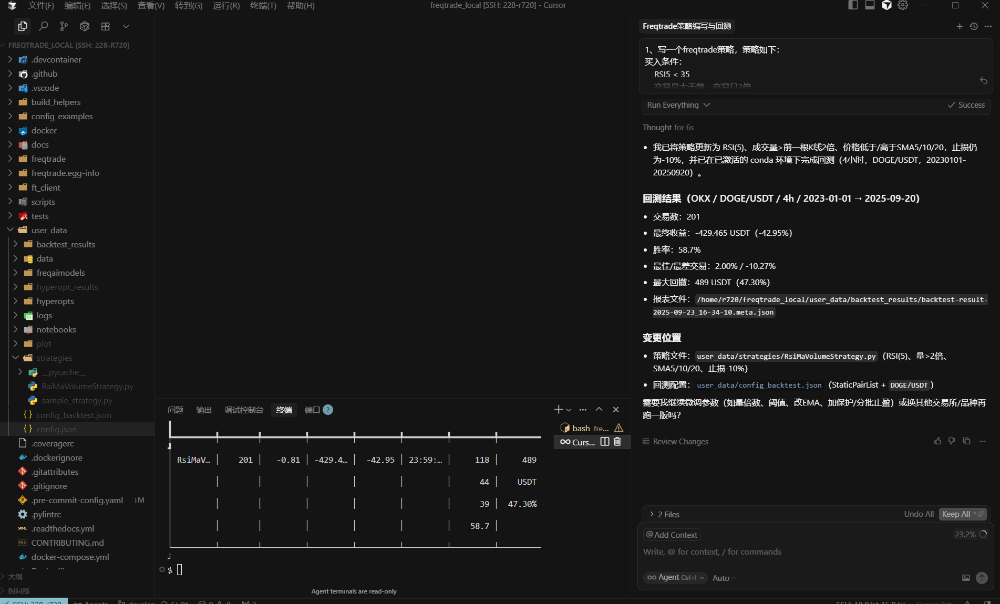

#### 开始第一个回测
首先给Cursor一个需求：
```
1、写一个freqtrade策略，策略如下：
买入条件：
    RSI5 < 35
    交易量大于前一交易日2倍
    价格低于5日、10日、20日均线
卖出条件：
    RSI5 > 70
    交易量大于前一交易日2倍
    价格高于5日、10日、20日均线
最优止损比例： -10%
2、当前目录使用'conda activate freqtrade'进入conda环境
3、回测DOGE/USDT交易品种并使用4小时k线对20230101-20250920进行回测
```


#### 优化
继续给Cursor：
```
对以上策略进行参数调优，并重新回测并绘制图表，主图k线叠加5日/10日/20日均线，副图1为成交量，副图2为5日RSI，副图3为macd
```
#### 再来
```
1、写一个freqtrade策略，策略如下：
买入条件：
    RSI5 < 35
    交易量大于前一交易日2倍
    价格低于5日、10日、20日均线
卖出条件：
    RSI5 > 70
    交易量大于前一交易日2倍
    价格高于5日、10日、20日均线
最优止损比例： -10%
2、当前目录使用'conda activate freqtrade'进入conda环境
3、回测DOGE/USDT交易品种并使用4小时k线对20250101-20250920进行回测
4、绘制图表，主图k线叠加5日/10日/20日均线，副图1为成交量，副图2为5日RSI，副图3为macd

```
